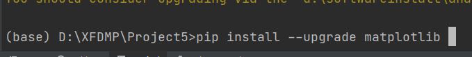

# 1 从文件读取数据，画三维图像

```python
#!/usr/bin/env python3
import sys
from matplotlib import pyplot as plt
import numpy as np  # 用来处理数据
from mpl_toolkits.mplot3d import Axes3D

##读取path的数值
ID=[]
PX=[]
PY=[]
PZ=[]
VALUE=[]
filename = './path.txt'
with open(filename, 'r') as f:
    lines = f.readlines()
    for line in lines:
        try:
            temp=line.split(' ')
            # print(temp[0])
            ID.append(int(temp[0]))
            PX.append(int(temp[1]))
            PY.append(int(temp[2]))
            PZ.append(int(temp[3]))
            VALUE.append(int(temp[4]))
        except:
            continue

##读取map的数值
MX=[]
MY=[]
MZ=[]
filename = './map.txt'
with open(filename, 'r') as f:
    lines = f.readlines()
    for line in lines:
        try:
            temp=line.split(' ')
            # print(temp[0])
            MX.append(int(temp[1]))
            MY.append(int(temp[2]))
            MZ.append(int(temp[3]))
        except:
            continue


fig=plt.figure()
ax=Axes3D(fig)
# ax.scatter(PX,PY,PZ,s=20,c='g',marker='s')
# ax.plot3D(PX,PY,PZ,linewidth=10,c='r')
# ax.scatter(MX,MY,MZ,c='r')
ax.bar3d(MX,MY,MZ,10,10,1,alpha=0.5)
ax.bar3d(PX,PY,PZ,10,10,1,alpha=0.5)

ax.set_xlabel('x')
ax.set_ylabel('y')
ax.set_zlabel('z')
ax.set_xlim([-150,400])
ax.set_ylim([-150,400])
# plt.savefig('com.jpg')
plt.gca().set_box_aspect((550, 550, 50))  # 当x、y、z轴范围之比为3:5:2时。
plt.show()
```

# 2 更新python的包

windows下进行matplotlib包的更新时，出现使用conda更新一直卡顿的问题

首先关闭代理，随后在pycharm的命令行执行

```shell
pip install --upgrade matplotlib
```




# 3 设置三维图像坐标轴的比例

需要较高版本的matplotlib中，使用set_box_aspect来进行

```python
fig=plt.figure()
ax = fig.add_subplot(111, projection='3d')
# ax.scatter(PX,PY,PZ,s=20,c='g',marker='s')
# ax.plot3D(PX,PY,PZ,linewidth=10,c='r')
# ax.scatter(MX,MY,MZ,c='r')
# print("ploting")
# ax.bar3d(PX,PY,PZ,10,10,10,alpha=0.5)
# print("ploted")
# ax.bar3d(MX,MY,MZ,10,10,1,alpha=0.5)

ax.plot3D(PX,PY,PZ,'blue', linestyle='--')    #绘制原始路径
# ax.plot3D(PX1,PY1,PZ1,color='red')    #绘制优化后的路径
ax.bar3d(MX,MY,MZ,1,1,1,alpha=0.5) #绘制地图

ax.set_xlabel('x')
ax.set_ylabel('y')
ax.set_zlabel('z')
ax.set_xlim([-1,50])
ax.set_ylim([-1,50])
ax.set_zlim([-1,10])
ax.set_box_aspect((5, 5, 1))
```

