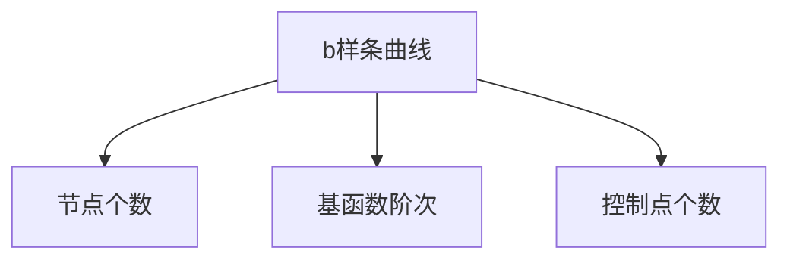
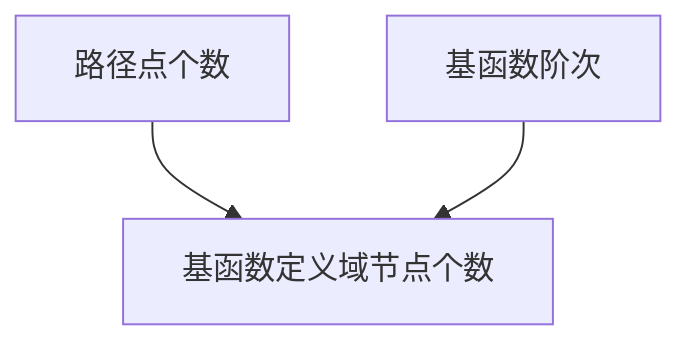

# 1 b样条的属性

```mermaid
graph TB;
    A[b样条曲线]-->B[节点个数];
	A-->C[基函数阶次];
	A-->D[控制点个数];
```

需要考虑三种，节点个数，基函数的阶次，控制点的个数。

## 1.1 b样条用来生成轨迹

对于生成轨迹的应用角度来说，有几个控制点，就需要几个基函数；每个基函数的阶次和节点的个数又相关；因此如果已经知道了控制点的个数，以及需要的基函数的阶次，那么是可以计算出来节点的个数的，进而得到基函数的个数，理论上基函数的个数应该和控制点的个数一样。

```mermaid
graph TB;
	A[路径点个数]-->B[基函数定义域节点个数];
	C[基函数阶次]-->B;
```

