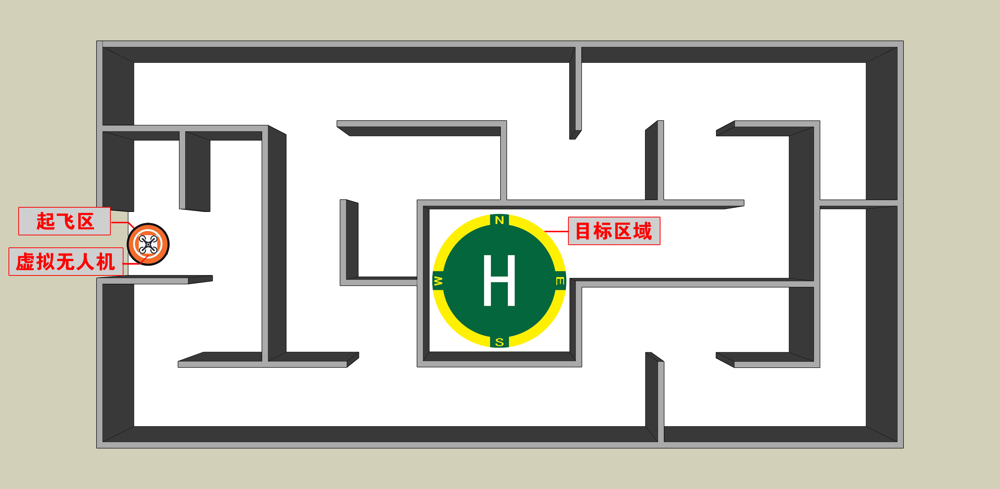
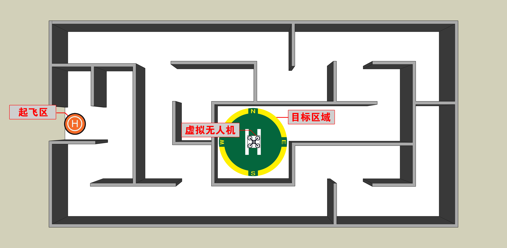
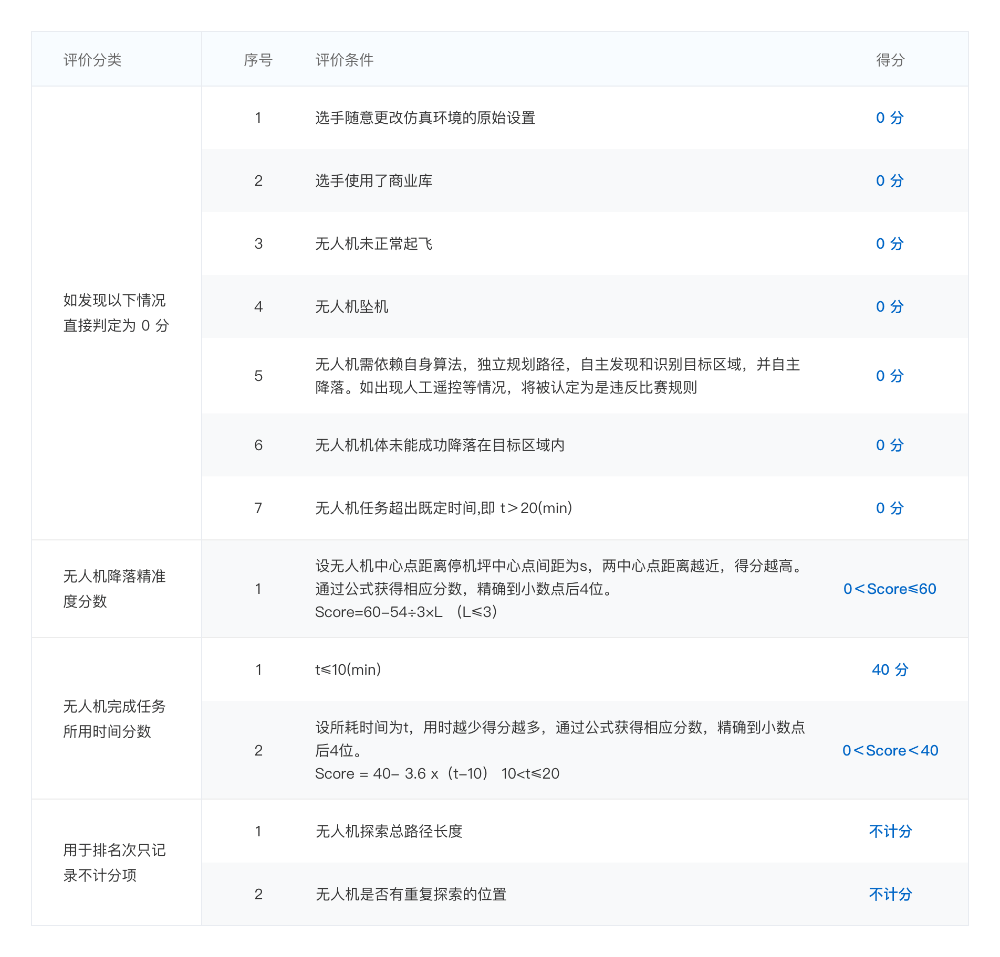

# 参赛须知
仿真赛共设两个科目，参赛者首先浏览题目内容及答题要求，科目一完成且分数达到60分可进行科目二答题，两道题目都有分数即完成仿真赛答题任务。

答题过程需要在仿真模拟器环境下进行编程和调试，飞行状态达到个人满意程度后可将作品进行上传，科目一、科目二均有2次上传机会，取两次最高成绩计入最终得分。

电脑配置上，建议CPU性能不低于Intel i7-9750H，GPU性能不低于Nvidia GTX1660Ti-MaxQ，因驱动兼容性问题不建议使用AMD显卡，内存不低于16G，具体电脑性能选择应与选手使用算法的复杂度相适应。操作系统安装建议采用双系统方式按照Ubuntu，虚拟机安装可能出现显卡驱动兼容性问题。
# 竞赛题目
虚拟无人机由仿真场景的入口处起飞，在20分钟内，发现并识别出迷宫中的目标区域，并完成在目标区域内自主降落，即任务完成。见示意图。

评判指标：无人机降落点距离中心点越近分数越高，用时越短分数越高。

# 相关下载
仿真模拟器下载：https://gitee.com/robin_shaun/XTDrone/

仿真环境快速部署：https://www.yuque.com/xtdrone/manual_cn/basic_config

使用Docker快速安装：https://www.yuque.com/xtdrone/manual_cn/docker

仿真器环境及无人机参数：点击下载
https://zhihangcup.chilunyc.com/doc/%E4%BB%BF%E7%9C%9F%E5%99%A8%E7%8E%AF%E5%A2%83%E5%8F%8A%E6%97%A0%E4%BA%BA%E6%9C%BA%E5%8F%82%E6%95%B0.pdf

比赛环境启动说明：https://www.yuque.com/xtdrone/manual_cn/zhihangcup
# 评分说明
(1) 每支参赛团队有2次提交作品的机会，取最高一次得分为团队成绩。

(2) 未得主办方允许，不得随意更改仿真环境的原始设置，否则被视为作弊行为，直接判定成绩无效。

(3) 比赛程序需要提供全部源代码及代码说明文档，赛后专家组会检查源代码，允许使用开源第三方库，不允许使用商业库，否则直接判定成绩无效。

(4) 虚拟无人机于限定时间内在设定场景里找到目标区域，并降落在目标区域内，如无人机未能在限定的时间内完成任务，则任务失败，不得分。

(5) 无人机需依赖自身算法，独立规划路径，自主发现和识别目标区域，并自主降落。如出现人工遥控等情况，将被认定为是违反比赛规则，直接判定成绩无效。

(6) 无人机在飞行过程中，如与迷宫墙壁发生碰触，仿真系统会模拟真实的碰触情况做出逼真的反应，无人机的飞行路径会发生偏移或坠机。如果在指定降落区域以外的其它位置降落或坠机，都将被评分系统视为任务失败，总成绩为0分。如无人机未被仿真系统判定为坠毁，则可继续执行任务。

(7) 仿真环境为了提供上帝视角，在迷宫上方设置了透明屋顶（空气墙），如果无人机飞行高度等于迷宫围墙的高度(3m)，则无人机会模拟真实的碰触情况做出逼真的反应，飞行路径会发生偏移或坠机。评判方式与碰壁的情况一样。

(8) 任务满分为100分，其中无人机降落精准度最高分为60分，完成任务用时分数最高分为40分，选手总分数为这两项分数相加。如果无人机降落精准度得分为0，则不会获得完成任务用时分数。

(9) 无人机降落精准度评分方法：无人机降落后，根据无人机中心点距离目标区域停机坪中心点间的距离来判断无人机是否成功降落在停机坪内以及可获得多少降落精准度分数，该分数最高分为60分。停机坪直径尺寸设为6m,半径为3m，设无人机中心点距离停机坪中心点间距为L，单位为米（m），精确到小数点后4位，四舍五入，详见下图。

当L＞3（m），则判断为无人机机体未能成功降落在目标区域停机坪上，即被认定为任务失败，得分为0。如示意图中的A、B、C无人机。

当0≤L≤3（m），则判断为无人机成功降落在目标区域停机坪内，任务完成。如示意图中的D、E、F、G、H无人机。

降落精准度分数算法如下：两中心点距离越近，得分越高，分数精确到小数点后4位，四舍五入。所对应记分公式：Score=60-54÷3×L

L≤3（m）

（10）完成任务用时分数评分方法：根据完成任务所耗时间长短，判定参赛选手所获时间分数，限定时间为20分钟，最佳完成任务时间为10分钟内，满分为40分。评分方法如下，设所耗时间为t,单位为分钟(min)，不足1分钟，以小数点的方式表示，精确到小数点后4位，四舍五入。

当t＞20(min)，则判断无人机未能在限定的时间内完成任务，即被认定为任务失败，得分为0。

当t≤10(min)，则判断无人机在最佳的时间范围内完成了任务，得分为40分。

当10(min)＜t≤20(min)，则判断无人机在限定的时间内完成了任务，但未能在最佳时间范围内完成任务，用时越少得分越多，具体得分可将完成任务用时代入计算公式得出，精确到小数点后4位，四舍五入。所对应记分公式：

Score=40-3.6×（t-10） 10＜t≤20

（11）如得分有相同分数的团队，则依次根据无人机探索总路径长度，无人机是否有重复探索的位置等情况进行排序。

（12）科目1评分表

