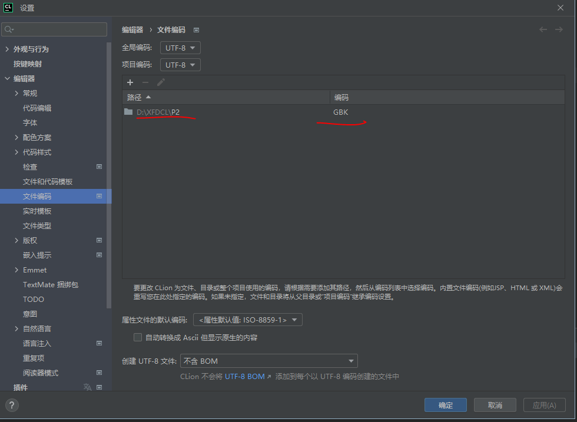
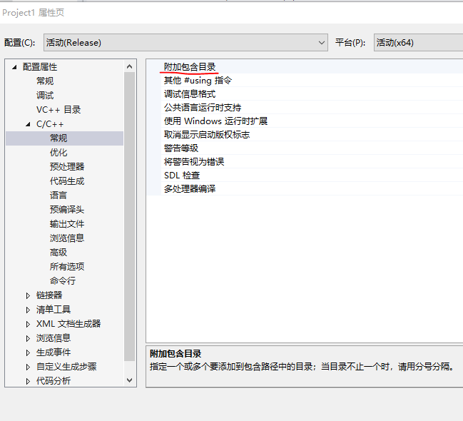
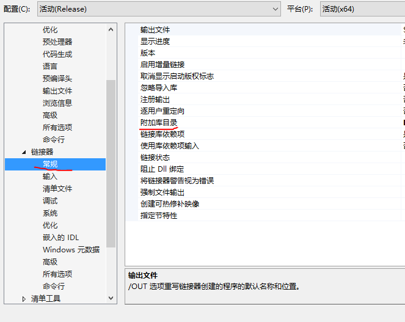
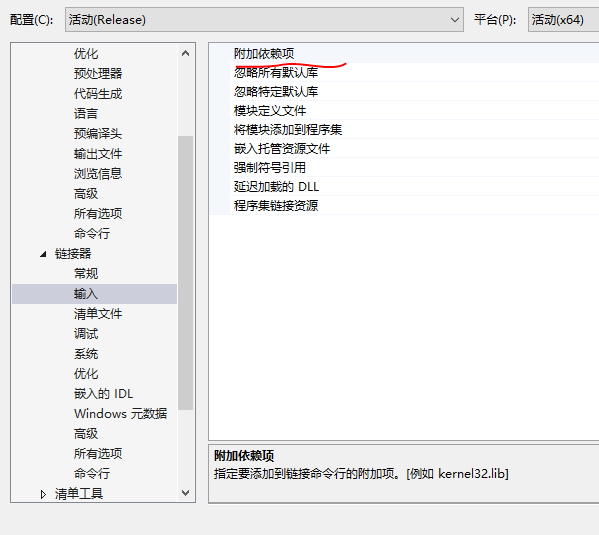

# 1 Clion软件

## 1.1 如何自动生成注释

函数的注释是怎么自动生成的呢，我们可以在函数名称上面一行输入/*！(或者///) 然后回车，即可自动生成注释。

## 1.2 文件编码问题

设置当前项目的编码格式

在设置->编辑器->文件编码->路径，将路径设置为当前项目的路径，编码在win下使用gbk编码

# 2 visual stdio软件

## 2.1 关于头文件目录，库目录

附加依赖项、库目录和包含目录
库目录和包含目录都是项目所要用到的库文件和头文件所在的位置；
头文件在代码中会以#include的形式进行引用，那么lib文件呢？
lib文件会在附加依赖项中进行设置，相当于设置一下项目所要依赖的库文件

## 2.2 代码编译的时候，很多错误，实际这错误不存在

这编码格式的问题，ubuntu的代码拷贝过来会有这种问题。
这些代码是下载的别人Ubuntu上的代码，编码格式水土不服，需要改成utf8带签名的才能正确编译。
那如何改成utf8带签名格式呢？步骤如下：
https://blog.csdn.net/dianshu9815/article/details/101885232
（1）单击“工具”|“自定义”命令，弹出“自定义”对话框。
（2）单击“命令”标签，进入“命令”选项卡。
（3）在“菜单栏”下拉列表中，选择“文件”选项。
（4）单击“添加命令”按钮，弹出“添加命令”对话框。
（5）在“类别”列表中，选择“文件”选项；在“命令”列表中，选择“高级保存选项”选项。
（6）单击“确定”按钮，关闭“添加命令”对话框。
（7）选中“控件”列表中的“高级保存选项”选项，单击“上移”或者“下移”按钮，调整该命令的位置。
（8）单击“关闭”按钮，完成“高级保存选项”命令的添加操作。
（9）打开“文件”菜单下的“高级保存选项”，设置编码 Unicode（utf-8带签名）- 代码页 65001
一定要注意最后一步，改成的格式为Unicode（utf-8带签名）- 代码页 65001，注意有个Unicode（utf-8不带签名）- 代码页 65001的不要选，否者依然报错。
**或者直接新建文件拷贝代码也可以。**

## 2.3 在vs中编译的逻辑

筛选器是选择哪些文件参与编译的
在编译的过程中，筛选器中的cpp文件和h文件，头文件路径下的h文件，库文件中的lib文件，将会参与编译。
如果采用第三的代码，如果是h和cpp的形式，则h路径设置一下，cpp放在筛选器下（h文件都可）；
如果采用第三的代码，如果是h和lib的形式，则h路径设置一下，lib路径设置一下，lib.dll文件设置一下

# 3 vscode软件

## 3.1 vscode配置编辑器的include路径

点击左边扩展栏图标—>搜索C/C++ -> 安装->Reload
安装完成之后，打开你的包含c++的文件夹，将会生成一个.vscode文件夹，所有的配置将在这个文件夹中进行配置。
扩展程序会根据当前系统环境配置基本信息，因此有可能配置不完整，这时需要通过生成c_cpp_properties.json文件来配置缺少的信息
ctrl+shift+P打开Command Palette,运行C/Cpp: Edit configurations...生成c_cpp_properties.json：
进行设置路径即可

## 3.2  vscode设置自动换行

# 4Git工具的使用

1.github创建仓库

2.git init

3.git add ./*

4.git commit -m "txt"

5.git remote add origin https://github.com/hongxt/t0613.git

6.

