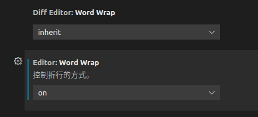

# 1 Clion软件

## 1.1 如何自动生成注释

函数的注释是怎么自动生成的呢，我们可以在函数名称上面一行输入/*！(或者///) 然后回车，即可自动生成注释。

## 1.2 文件编码问题

设置当前项目的编码格式


在设置->编辑器->文件编码->路径，将路径设置为当前项目的路径，编码在win下使用gbk编码

# 2 visual stdio软件

## 2.1 关于头文件目录，库目录

附加依赖项、库目录和包含目录
库目录和包含目录都是项目所要用到的库文件和头文件所在的位置；
头文件在代码中会以#include的形式进行引用，那么lib文件呢？
lib文件会在附加依赖项中进行设置，相当于设置一下项目所要依赖的库文件


## 2.2 代码编译的时候，很多错误，实际这错误不存在

这编码格式的问题，ubuntu的代码拷贝过来会有这种问题。
这些代码是下载的别人Ubuntu上的代码，编码格式水土不服，需要改成utf8带签名的才能正确编译。
那如何改成utf8带签名格式呢？步骤如下：
https://blog.csdn.net/dianshu9815/article/details/101885232
（1）单击“工具”|“自定义”命令，弹出“自定义”对话框。
（2）单击“命令”标签，进入“命令”选项卡。
（3）在“菜单栏”下拉列表中，选择“文件”选项。
（4）单击“添加命令”按钮，弹出“添加命令”对话框。
（5）在“类别”列表中，选择“文件”选项；在“命令”列表中，选择“高级保存选项”选项。
（6）单击“确定”按钮，关闭“添加命令”对话框。
（7）选中“控件”列表中的“高级保存选项”选项，单击“上移”或者“下移”按钮，调整该命令的位置。
（8）单击“关闭”按钮，完成“高级保存选项”命令的添加操作。
（9）打开“文件”菜单下的“高级保存选项”，设置编码 Unicode（utf-8带签名）- 代码页 65001
一定要注意最后一步，改成的格式为Unicode（utf-8带签名）- 代码页 65001，注意有个Unicode（utf-8不带签名）- 代码页 65001的不要选，否者依然报错。
**或者直接新建文件拷贝代码也可以。**

## 2.3 在vs中编译的逻辑

筛选器是选择哪些文件参与编译的
在编译的过程中，筛选器中的cpp文件和h文件，头文件路径下的h文件，库文件中的lib文件，将会参与编译。
如果采用第三的代码，如果是h和cpp的形式，则h路径设置一下，cpp放在筛选器下（h文件都可）；
如果采用第三的代码，如果是h和lib的形式，则h路径设置一下，lib路径设置一下，lib.dll文件设置一下

# 3 vscode软件

## 3.1 vscode配置编辑器的include路径

点击左边扩展栏图标—>搜索C/C++ -> 安装->Reload
安装完成之后，打开你的包含c++的文件夹，将会生成一个.vscode文件夹，所有的配置将在这个文件夹中进行配置。
扩展程序会根据当前系统环境配置基本信息，因此有可能配置不完整，这时需要通过生成c_cpp_properties.json文件来配置缺少的信息
ctrl+shift+P打开Command Palette,运行C/Cpp: Edit configurations...生成c_cpp_properties.json：
进行设置路径即可

## 3.2  vscode设置自动换行



# 4Git工具的使用

## 4.1 同步本地仓库到远程

其中的一种简略的方法，基本思想是先从远程下载，基于其进行修改。

1. 在github上创建远程仓库

2. 在本地创建文件夹，在文件夹内下载仓库

   ```bash
   git clone <远程url>
   ```

3. 切换到文件夹内，添加新的文件，或者进行修改

4. 将文件添加到缓存

   ```bash
   git add ./*
   ```

5. 将缓存同步到本地仓库

   ```bash
   git commit -m "备注"
   ```

6. 同步到远程

   ```
   git push
   ```


7. 后续的改变操作

   ```bash
   git add ./*
   git commit -m "备注"
   git push
   ```

## 4.2 git的常用命令

### 4.2.1 git remote add origin <远程url>

`git remote add origin https://github.com/ihechikara/git-and-github-tutorial.git` 是一个 Git 命令，用于将远程仓库与本地仓库建立关联。

解释每个部分的含义：

- `git remote`: 这是 Git 命令的一部分，用于管理远程仓库。
- `add`: 这是 `git remote` 命令的一个子命令，用于添加一个新的远程仓库。
- `origin`: 这是远程仓库的名称，可以根据个人喜好任意指定，通常用于指代远程仓库的默认名称。
- `https://github.com/ihechikara/git-and-github-tutorial.git`: 这是远程仓库的 URL，指定了远程仓库的位置。

因此，`git remote add origin https://github.com/ihechikara/git-and-github-tutorial.git` 的意思是将名为 `origin` 的远程仓库与位于 `https://github.com/ihechikara/git-and-github-tutorial.git` 的远程仓库建立关联。建立关联后，你可以使用 `origin` 来引用该远程仓库，例如进行推送（`git push`）或拉取（`git pull`）操作。

### 4.2.2 git push -u origin main

`git push -u origin main` 是一个 Git 命令，用于将本地分支推送到远程仓库。

解释每个部分的含义：

- `git push`: 这是 Git 命令的一部分，用于将本地的提交推送到远程仓库。
- `-u`: 这是 `git push` 命令的一个选项，它表示将本地分支与远程分支关联起来，并将其设置为 "upstream"。
- `origin`: 这是远程仓库的名称，通常用于指代远程仓库的默认名称。
- `main`: 这是要推送的本地分支的名称。在较新的版本中，`main` 通常用作默认的主分支名称。如果你的仓库中使用的是旧版本的 Git，可能会使用 `master` 作为默认的主分支名称。

因此，`git push -u origin main` 的意思是将当前本地分支的提交推送到名为 `origin` 的远程仓库，并与远程仓库的 `main` 分支关联起来。使用 `-u` 选项后，下次推送时可以直接使用 `git push`，Git 将自动将提交推送到正确的远程分支。

## 4.3 采用的git branch相关

Git 中与分支（branch）相关的常用命令有：

1. `git branch`：列出所有本地分支。
2. `git branch <branch-name>`：创建一个新的分支。
3. `git branch -d <branch-name>`：删除指定的本地分支。
4. `git branch -m <old-branch-name> <new-branch-name>`：重命名分支。
5. `git branch -a`：列出所有本地分支和远程分支。
6. `git branch -r`：列出所有远程分支。
7. `git branch -vv`：显示本地分支与远程分支的跟踪关系。
8. `git branch --merged`：列出已经合并到当前分支的分支。
9. `git branch --no-merged`：列出尚未合并到当前分支的分支。
10. `git checkout <branch-name>`：切换到指定的分支。
11. `git checkout -b <branch-name>`：创建一个新的分支并切换到该分支。
12. `git checkout -`：切换到上一个分支。
13. `git merge <branch-name>`：将指定分支合并到当前分支。
14. `git rebase <branch-name>`：将当前分支变基到指定分支。
15. `git push origin <branch-name>`：将本地分支推送到远程仓库。
16. `git pull origin <branch-name>`：从远程仓库拉取指定分支的更新。

这些命令可用于创建、删除、重命名、切换、合并、拉取和推送分支，以及查看分支的状态和关系。

# 5 PX4软件说明
## 5.1 查看版本号
```bash
git describe --always --tags
```
