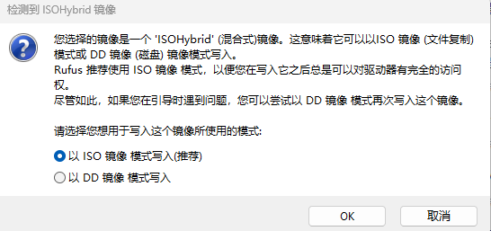

# 1 ubuntu系统相关

## 1.1 ubuntu下采用clash科学上网

1.确保联网，登录帐号，测试是否可以上百度www.baidu.com

2.打开clash，Profiles页面将订阅地址输入其中，并下载下来


3.在proxies页面，选择global，点击合适的节点


4.在general页面，查看端口的数值


5.在系统的代理窗口设置代理的地址


6.结束，测试www.google.com

## 1.2 ubuntu常用指令和功能

### 1.2.1 查看系统cpu架构类型

```shell
arch
```

CPU架构是cpu厂商给属于同一系列的CPU产品定的一个规范，主要目的是为了区分不同类型CPU的重要标示。目前市面上的CPU分类主要分有两大阵营，一个是intel、AMD为首的复杂指令集CPU，另一个是以IBM、ARM为首的精简指令集CPU。两个不同品牌的CPU，其产品的架构也不相同，例如，Intel、AMD的CPU是X86架构的，而IBM公司的CPU是PowerPC架构，ARM公司是ARM架构。

### 1.2.2 文件夹不显示侧边栏

在使用ubuntu过程中，有时候打来文件发现侧边栏不见了
这时候设置别的也没办法解决
但其实只要一个按键就好啦，就是F9
在当前文件界面，按下F9，侧边栏就出现啦
如果没出现的话，就shift+F9
over行动起来，完美解决！

## 1.3 ubuntu18.04配置python环境

目的是替代掉系统自带的python3，实现安装px4最新版本的时候很方便  

1 下载安装的sh文件  

https://mirrors.tuna.tsinghua.edu.cn/help/anaconda/  

https://mirrors.tuna.tsinghua.edu.cn/anaconda/archive/  

2 复制到虚拟机中，在终端运行  

```shell
bash Anaconda3-2022.10-Linux-x86_64.sh
```
同意安装   
同意协议    
同意安装位置   
同意写入bashrc文件 <font color=red>【no】</font>    
3 使用update-alternatives进行配置    

```shell
sudo update-alternatives --install /usr/bin/python python /usr/bin/python2.7 20
sudo update-alternatives --install /usr/bin/python python /home/hongxt/anaconda3/bin/python 30
sudo update-alternatives --config python
```
4 配置python3  
除了上面配置python的环境，系统里面的python,python2,python3都是链接的形式，因此可以一样的方法为python3配置可以切换的多环境并存  

## 1.4 ubuntu终端设置proxy

A.ubuntu设置终端代理和清除代理命令（命令行测试与设置是同步的）  
1.添加代理  

```shell
export http_proxy=http://proxyAddress:port  
export https_proxy=http://proxyAddress:port  
```
2.查看代理  
```shell
env |grep -i proxy  
```
3.清除代理  
```shell
unset http_proxy  
unset https_proxy  
```

B. 设置github代理  
1.查看git配置  

```shell
git config -l  
```
2.一共两个协议，两种不同的协议对应后面不同的后缀名与当前的代理端口  
```shell
git config --global https.proxy https://127.0.0.1:12333  
git config --global http.proxy http://127.0.0.1:12333  
git config --global https.proxy socks5://127.0.0.1:10808  
git config --global http.proxy socks5://127.0.0.1:10808 
```
3.取消代理  
```shell
git config --global --unset http.proxy  
git config --global --unset https.proxy  
```

## 1.5 snap、apt和apt-get


## 1.6 ubuntu18.04配置gdal高版本

ubuntu自带有proj（gdal的依赖）和gdal，但是版本较低，删除升级的时候，会牵扯到ros，下面提供一种不影响ros的方法  
下载proj和gdal的release文件进行编译安装  
(1)安装sqlite3  

```shell
 sudo apt install sqlite3  
```
(2)proj  
```shell
 cd proj-6.3.2  
 mkdir build  
 cd build  
 cmake ..  
 make -j8  
 sudo make install  
```
 设置路径
```shell
 export LD_LIBRARY_PATH=$LD_LIBRARY_PATH:/usr/local/lib  
```
<font color=red>(3)删除原来的gdal  </font>  
```shell
 sudo rm -rf /usr/share/gdal/*  
 sudo rm -rf /usr/include/gdal/*  
```
(4)安装新的  
```shell
 cd gdal332  
  ./configure  --with-proj=/usr/local  
 make   
 sudo make install  
```
(5)完事  
 安装在了/usr/local里面的include和lib中  

## 1.7 ubuntu免卸载安装cmake实现多版本共存方法

（1）	下载源码  
https://cmake.org/download/  
（2）	解压运行  
```shell
./bootstrap  
```
（2.1）另起终端，将原来的cmake改名cmake3.10，建立到update-alternatives中看看行不行，避免后续名字冲突  
```shell
cd /usr/bin/  
mv cmake cmake3.10  
sudo update-alternatives --install /usr/bin/cmake cmake /usr/bin/cmake3.10 10  
sudo update-alternatives --config cmake  
cmake --version  
```
（3）	编译构建  
```shell
make  
```
（4）	安装到指定自定义位置（注意路径不能有空格）  
```shell
sudo make install DESTDIR=/home/hongxt/tools/cmake3.25  
```
（5）	使用update-alternatives进行安装  
```shell
sudo update-alternatives --install /usr/bin/cmake cmake /home/hongxt/tools/cmake3.25/usr/local/bin/cmake 30  
```
（6）	查看cmake的配置  
```shell
sudo update-alternatives --config cmake  
```
ubuntu软件更新会导致/usr/bin/重新出现cmake可执行文件，破坏掉链接，可以再次修改cmake可执行文件的名字即可

## 1.8 联想Y7000 2020 安装ubuntu双系统的步骤

### （0）参考链接

整体步骤：https://blog.csdn.net/laonafahaodange/article/details/117771013

查看系统启动类型：https://zhuanlan.zhihu.com/p/102000176

写入镜像类型区别：https://zhuanlan.zhihu.com/p/102000176

文件系统类型格式：https://zhuanlan.zhihu.com/p/102000176


### （1） 下载ubuntu镜像

```c++
https://releases.ubuntu.com/
```

### （2）下载系统盘制做工具

使用rufus制作

### （3）BIOS启动模式查看

BIOS启动模式有UEFI+GPT和Legacy+MBR两种，如今大多数新机型电脑都采用了UEFI的启动模式来引导系统，即便如此，仍有部分电脑采用Legacy启动模式。

win+R，输入

```shell
msinfo32
```


查看在弹出的窗口查看类型


UEFI对应GPT

Legacy对应MBR

### （4）文件系统类型选择

1、NTFS格式对闪盘芯片有伤害

　　随着WINDOWS系统的发展NTFS格式逐渐成为win系统主流文件格式，NTFS拥理论上可以支持大到16000GB的存储空间（单文件），远远大于一般用户所需要的文件大小，它不仅大，而且快。现在超过4GB的u盘格式化时默认是NTFS分区，但是这种格式是很伤u盘的，因为NTFS分区是采用“日志式”的文件系统，需要记录详细的读写操作，肯定会比较伤闪盘芯片，因为要不断读写。

　　2、exFAT格式最适合U盘

　　随着FAT32的力不从心，WIN发展了NTFS，MACOS发展了APFS，这两种文件格式互不兼容，这个时候EXFAT出现了，这个格式支持WIN、LINUX、MACOS方便在各个系统之间拷贝文件。exFAT格式是微软公司特地为u盘量身定做的一种格式，exFAT格式恰恰在FAT32与NTFS之间取得一个折衷，有FAT32的轻便、不需要耗损太多的效能及记忆体来处理档案运作，又有类似NTFS的CAL存取控制机制（很可惜在SP1下找不到exFAT对于CAL的支援），以及类似HPFS系统可快速整理可用丛集空间的Free Space Bitmap，来将档案破碎的情况尽量减少。

　　3、FAT32格式不支持4GB以上的文件

　　FAT32这种FAT格式，因为发展较早，所以通用性很高，各种操作系统都支持FAT。但是同样地，由于FAT起源较早，它没有办法较好地支持后来出现的新技术，甚至不支持单个大于4G的文件，这一点非常致命。u盘是用来存储文件的，现在大文件也很多，例如大型游戏，专业软件工具等，如果文件超过4GB，即使u盘容量很大，也无法使用FAT32格式u盘进行文件存储。 作者：也爱晚风也爱晨 https://www.bilibili.com/read/cv16865788/ 出处：bilibili

### （5）烧写系统盘


ISO 镜像是一种数据存储格式，通常用于创建软件的安装光盘或者备份数据。 ISO 镜像包含了完整的文件系统，并且可以使用 CD/DVD 或者 USB 驱动器刻录到光盘或者 USB 存储设备中，从而实现安装或者备份的目的。

DD 镜像是一种数据备份格式，通常用于备份整个硬盘或者分区的内容。DD 镜像是一个位于位置的字节映像，它可以备份整个硬盘或者分区的数据，包括操作系统、软件和用户数据。DD 镜像可以在恢复系统时使用，以保证恢复后的系统和原始系统完全一致。

总的来说，ISO 镜像适用于创建软件的安装光盘和备份数据，而 DD 镜像适用于备份整个硬盘或者分区的内容。



### （6）磁盘分区准备

#### a.第一次安装

##### (a)右键此电脑，选择**管理**

##### (b）选择**磁盘管理**

##### (c)右键C盘（固态硬盘），选择**压缩卷**

##### (d)输入压缩空间量，100-200G

##### (e)点击**压缩**，等待压缩成功即可

#### b.需要卸载安装

##### (a)右键此电脑，选择**管理**

##### (b)选择**磁盘管理**

##### (c)右键之前安装的盘ubuntu所在的旧分区，右键删除即可


旧的efi可能无法删除，采用命令行删除分区
diskpart
list disk
select disk #（#指的是你想要删除的分区所在的硬盘号）
list partition
select partition #（#指的是你想要删除的分区号）
delete partition override
exit

##### (d)删除旧ubuntu的开机引导项

###### a)Win + R 打开cmd


###### b)输入diskpart


###### c)输入list disk


###### d)选择你的windows所在的盘，我这里输入 select disk 1


###### e)输入list partition


###### f)选择300M大小的系统类型，输入 select partition 1


###### g)输入assign letter = p


###### h)点击 我的电脑 会发现多了个P盘，鼠标双击进不去，用管理员打开记事本 选择 文件->打开 找到P盘


###### i)进入EFI文件夹，右键删除ubuntu即可


###### j)输入remove letter = p，删除P盘


##### (e)禁止安全启动

开机狂按F2，进入bios后，修改**Secure Boot**为**Disabled**


如果不修改可能会出现显卡驱动等方面的问题，在双系统存续期间，最好该选项为disable


##### (f)安装ubuntu

###### a)确认电脑关机后，插入U盘

###### b)按开机键，开机狂按F12，进入Boot Manager，通过上下方向键选择你的U盘，按回车键


###### c)进入安装界面


开始检查


选择安装


###### d)welcome界面

选择安装


###### e)keyboard layout界面

选择美国


###### f)wireless界面

选择不联网


###### g)updates and other software

选择默认


###### h)**installation tye**【重点】

选择someting else 


###### i)找到free space


###### j)efi分区

200m虽然够用，但是更新会不够，最好给1024m


###### l)swap分区

默认给内存大小即可，内存整数倍


###### m)系统根目录分区

系统分区，给30-50g，是c盘


###### n)用户home分区

自己存储数据的，多多益善，剩下的50g给它


###### o)确认efi，并开始安装

保证boot loader安装的位置是之前分区的位置


###### p)再次确认


###### q)设置时区

大上海


###### r)设置用户名，电脑名，密码


###### s)等待


###### u)完成


###### v)重启拔掉u盘


###### w)进入双系统选择窗口


# 2 windows系统相关

## 2.1 windows系统修改cmd窗口utf-8编码格式

1、临时修改：

只作用于当前窗口，先进入cmd命令窗口（快捷键win键+R）。

直接输入“chcp 65001”，回车键（Enter键）执行，这时候该窗口编码已经是UTF-8编码了。

2、永久修改：

win键+R，输入regedit，确定。

按顺序找到HKEY_LOCAL_MACHINE\SOFTWARE\Microsoft\Command Processor。

点击右键-新建，选择“字符串值”。

命名为“autorun”, 点击右击修改，数值数据填写“chcp 65001”，确定。

需要注意的是，这种方法会影响所有命令行窗口的编码设置。如果想要恢复默认设置，只需要将“Autorun”字符串值的值数据清空即可。

